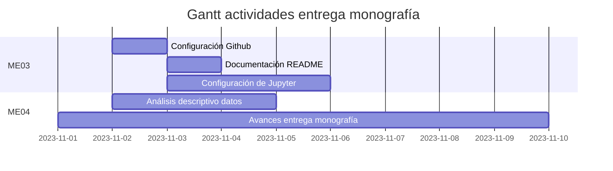

<a name="readme-top"></a>


<br/>
<div align='center'>
    <h2>Uso de inteligencia artificial para mejorar el desempeño de un proyecto de generación fotovoltaica</h2>
    <h3> Seminario Analítica y Ciencia de Datos </h3>
    <p>
        Material correspondiente a la entrega de los momentos evaluativos sobre el Seminario de Analítica y Ciencia de Datos.
        <br/>
        <a href='docs/ME02/data_product_canvas.pdf'><strong>Revisar la documentación »</strong></a>
    </p>
</div>

## Acerca del proyecto

Este proyecto tiene como objetivo abordar el desafío de aportar en la optimización de la gestión de energía solar fotovoltaica a partir del desarrollo de modelos que permitan predecir la disponibilidad de radiación solar en la ubicación del futuro Parque Solar Fotovoltaico Tepuy en La Dorada, departamento de Caldas. Haciendo uso de técnicas de aprendizaje automático sobre datos de irradiancia solar e información meteorológica medidos a lo largo del tiempo en la ubicación del proyecto.

## Herramientas requeridas

* Python 3.10
* Jupyter Lab (Google Colab)
* Cuenta de Kaggle

## Descripción del repositorio

Los archivos del repositorio de encuentran distribuidos en 3 directorios principales `docs`, `imgs` y `jupyter`.

* **docs:** Contiene subdirectorios para cada momento evaluativo incluyendo documentación en formato `tex`, que puede ser visualizada por medio de `overleaf`.
* **imgs:** Imágenes usadas en los distintos archivos tanto de documentación como cuadernos jupyter.
* **jupyter:** Incluye Subdirectorios por momento evaluativo con notebooks de jupyter asociados con la actividad requerida.

## Guía de ejecución paso a paso ME03

Para realizar la ejecución del notebook, es necesario realizar los siguientes pasos:
1. ingresar a [Google Colaboratory](https://colab.research.google.com/?hl=es) e iniciar sesión con su cuenta de Github
2. Hacer clic en "Archivo>Abrir Cuaderno" y seleccionar la opción Github.
3. Desde la ventana de selección de notebooks, buscar el repositorio actual copiando la URL 
```
https://github.com/MoisesGuerreroUdeA/Seminario-Analitica-CDatos
```
4. En la pestaña seleccionar la rama `main`
5. Seleccionar y abrir el notebook con nombre `jupyter/ME03/ME03.ipynb`
6. Una vez abierto el notebook, la ejecución requiere de un archivo de credenciales de Kaggle con nombre `kaggle.json`. Este archivo puede ser generado desde su usuario de Kaggle, ingresando a https://www.kaggle.com/settings y accediendo a la opción "API>Create New Token".
7. Una vez generado el token de Kaggle, este se debe subir a la carpeta de archivos del entorno de ejecución de Colab.
8. A continuación solo es necesario ejecutar el notebook.
9. Luego de la ejecución se genera un archivo en formato `.pickle` con el dataset transformado y preparado que puede ser descargado desde la interfaz de Colab.

## Actividades



