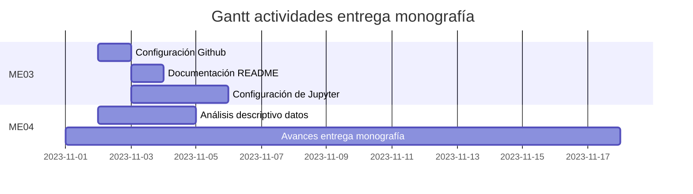

<a name="readme-top"></a>


<br/>
<div align='center'>
    <h2>Diseño de una solución para la predicción de radiación solar en diferentes escalas temporales para la región de la Comunidad de Castilla y León, España, para la gestión de proyectos de generación fotovoltaica.</h2>
    <h3> Seminario Analítica y Ciencia de Datos </h3>
    <p>
        Material correspondiente a la entrega de los momentos evaluativos sobre el Seminario de Analítica y Ciencia de Datos.
        <br/>
        <a href='documentos/'><strong>Revisar la documentación »</strong></a>
    </p>
</div>

## Acerca del proyecto

Este proyecto tiene como objetivo desarrollar una solución para la predicción de radiación solar en diferentes escalas temporales para diferentes estaciones meteorológicas de la Comunidad de Castilla y León, España, que permita la toma de decisiones alrededor de proyectos de generación fotovoltaica.

## Herramientas requeridas

* Python 3.10
* Jupyter Lab (Google Colab)

## Descripción del repositorio

Los archivos del repositorio de encuentran distribuidos en 3 directorios principales `docs`, `imgs` y `jupyter`.

* **documentos:** Contiene subdirectorios para cada momento evaluativo incluyendo documentación en formato `tex`, que puede ser visualizada por medio de `overleaf`, así como documentos en formato `docx` con su correspondiente versión en `pdf`.
* **imgs:** Imágenes usadas en los distintos archivos tanto de documentación como cuadernos jupyter.
* **jupyter:** Incluye Subdirectorios por momento evaluativo con notebooks de jupyter asociados con la actividad requerida.

## Guía de ejecución paso a paso ME04

Para realizar la ejecución del notebook, es necesario realizar los siguientes pasos:
1. ingresar a [Google Colaboratory](https://colab.research.google.com/?hl=es) e iniciar sesión con su cuenta de Github
2. Hacer clic en "Archivo>Abrir Cuaderno" y seleccionar la opción Github.
3. Desde la ventana de selección de notebooks, buscar el repositorio actual copiando la URL 
```
https://github.com/MoisesGuerreroUdeA/Seminario-Analitica-CDatos
```
4. En la pestaña seleccionar la rama `main`
5. Seleccionar y abrir el notebook con nombre `jupyter/ME04/ME04.ipynb`
6. A continuación solo es necesario ejecutar el notebook.
7. Luego de la ejecución se genera un archivo con nombre `CyL_processed.zip`, el cual contiene una serie de archivos en formato `.parquet` con los datasets transformados y preparados, para cada una de las 37 estaciones meteorológicas, que puede ser descargado desde la interfaz de Colab para ser usado posteriormente.

## Actividades



