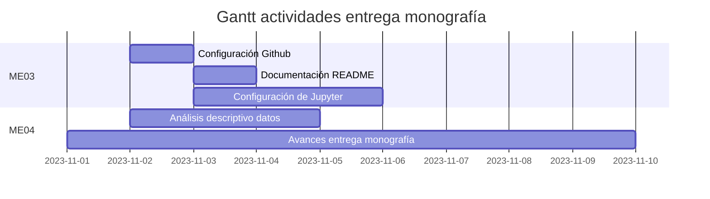

 

    <h2>Uso de inteligencia artificial para mejorar el desempeño de un proyecto de generación fotovoltaica</h2>
    <h3> Seminario Analítica y Ciencia de Datos </h3>
    

        Material correspondiente a la entrega de los momentos evaluativos sobre el Seminario de Analítica y Ciencia de Datos.
         
        <a href='#'><strong>Revisar la documentación »</strong></a>
    

## Acerca del proyecto

Este proyecto tiene como objetivo abordar el desafío de aportar en la optimización de la gestión de energía solar fotovoltaica a partir del desarrollo de modelos que permitan predecir la disponibilidad de radiación solar en la ubicación del futuro Parque Solar Fotovoltaico Tepuy en La Dorada, departamento de Caldas. Haciendo uso de técnicas de aprendizaje automático sobre datos de irradiancia solar e información meteorológica medidos a lo largo del tiempo en la ubicación del proyecto.

## Herramientas requeridas

* Python3
* Google Colab

## Actividades

## Descripción de archivos

Los archivos se encuentran distribuidos incluyendo los documentos relacionados con las entregas realizadas hasta el momento en formato `.tex`.